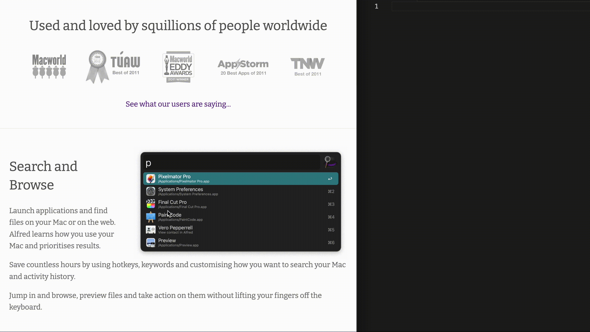

# alfred-textshot 📸

An Alfred Workflow to recognize & copy the text of a selected area on your screen.

## Prerequisites

- Tesseract OCR installed (`brew install tesseract` if you have Homebrew)

## Installation

1. Download the latest release of this workflow from the GitHub releases page.
2. Double-click the downloaded `.alfredworkflow` file to install it in Alfred.

## Usage

1. Trigger the workflow using your chosen Alfred hotkey (default is `⌘ + ⇧ + T`).
2. Select the area of the screen you want to capture with your mouse.
3. The text recognized from the screenshot will automatically be copied to your clipboard.

## Changelog

- 2023-06-27: v1.0 initial release
